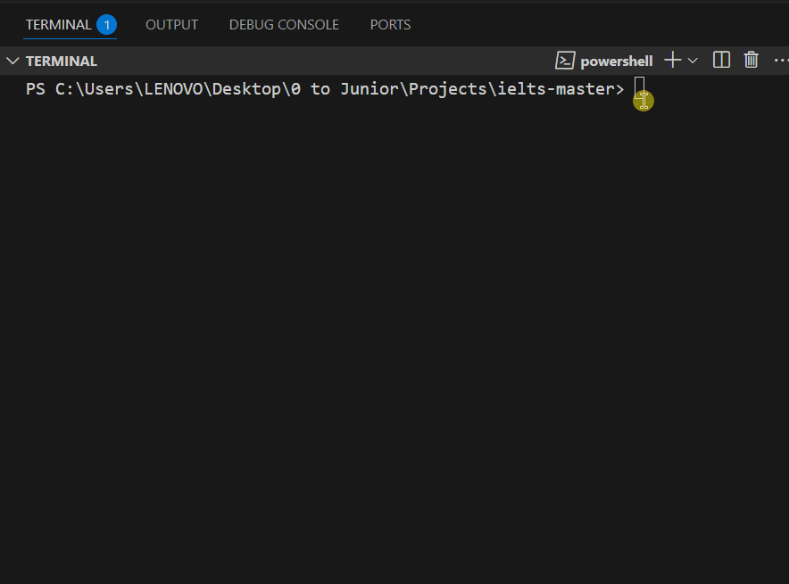

# ielts-master
Dastur kodi OOP shaklida, ya'ni, classlar yaratilib va ulardan obyektlar olgan holatda yozilgan

*Bu dastur foydalanuvchiga IELTS imtihonidagi Overal Ball ni hisoblashga yordam beradi*

---
**Dasturning ishlash jarayoni:**

